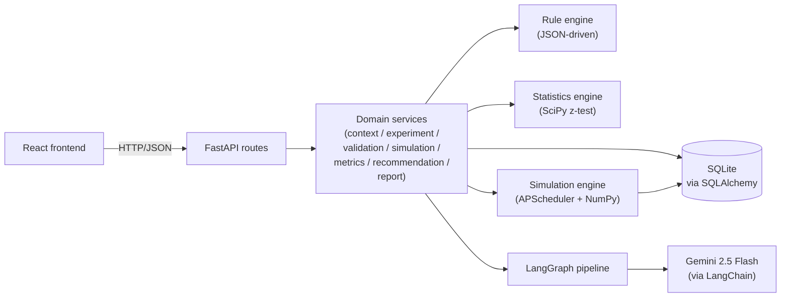

# AI A/B Testing Copilot

> Turn a vague product goal into a validated, live-simulated A/B experiment in minutes — with an AI copilot that proposes the hypothesis, runs the rule checks, simulates the results, and writes the executive report.

**Stack:** FastAPI · SQLAlchemy · LangGraph · LangChain · Gemini · APScheduler · SciPy · NumPy · Pydantic 2 · React · Vite · TypeScript

---

## Table of Contents

- [What it is](#what-it-is)
- [Who it's for](#who-its-for)
- [Key features](#key-features)
- [Architecture at a glance](#architecture-at-a-glance)
- [The user journey](#the-user-journey)
- [Getting started](#getting-started)
- [Environment variables](#environment-variables)
- [Try it end-to-end (curl)](#try-it-end-to-end-curl)
- [Repository layout](#repository-layout)
- [Running the tests](#running-the-tests)
- [Configurability — the "decision automation" pitch](#configurability--the-decision-automation-pitch)
- [Deploying](#deploying)
- [What's next / known gaps](#whats-next--known-gaps)
- [License](#license)

---

## What it is

**AI A/B Testing Copilot** is an AI-powered decision-support system that walks a Product Manager from a raw business problem to a launched, statistically-analysed A/B experiment — without any code and without a data science team on call.

You describe a business goal in plain English ("increase checkout conversion by 10%"), name the pain point ("users abandon at the payment step"), and pick which page you want to test. The copilot:

1. Understands the problem (LLM).
2. Proposes a testable hypothesis and the right success + guardrail metrics (LLM, catalog-constrained).
3. Runs a **configurable rule engine** to validate the draft against 10 sanity rules (deterministic).
4. Designs the experiment configuration — feature flag, audience, traffic split, sample size, duration (LLM, catalog-constrained).
5. Pauses so *you* can review and edit anything you want.
6. When you launch, a synthetic metrics simulator ticks every 5 seconds, feeding real z-tests through a **recommendation rule engine** that emits **scale / continue / stop / rollback**.
7. When you're ready, generates an executive report with a business-impact estimate.

Every AI decision is grounded by structured outputs and rule engines — the LLM narrates decisions but never quietly invents metric names, audiences, or thresholds.

## Who it's for

- **Product Managers** who need to design and run A/B tests without a data team.
- **Data scientists** prototyping experiment specs quickly.
- **Engineering platforms teams** looking for a reference implementation of "configurable decision automation" against structured requests.
- **Interviewees and educators** who want to see a full LLM + rule engine + statistical pipeline wired together.

## Key features

- 🧠 **Zero-code experiment authoring** — describe the goal, get a full draft.
- 🎯 **Catalog-constrained AI output** — the LLM can only pick from a fixed set of features, audiences, metrics, and traffic splits. No hallucinations.
- ⚙️ **Configurable rule engine** — 19 built-in operators (numeric / string / boolean / date / composite), priority-ranked, driven by JSON. Add a new rule in a JSON file, restart, done.
- 📊 **Real statistics** — SciPy two-proportion z-tests, p-values, confidence, conversion lift, winner determination.
- 🔀 **Recommendations with 4 outcomes** — `scale` / `continue` / `stop` / `rollback`, with guardrail-regression detection.
- 🎲 **Deterministic simulation** — seeded NumPy RNG per experiment, so demos and tests are reproducible tick-for-tick.
- 👤 **Human-in-the-loop review** — the graph pauses after the draft so the PM can edit before launch.
- 🕒 **Live-tick simulation** — APScheduler produces synthetic metrics every 5 seconds; the dashboard polls and watches variant win in real time.
- 🔎 **LangSmith tracing hooks** — every LLM call and graph node is traced automatically when `LANGCHAIN_API_KEY` is set.
- ✅ **75 automated tests** — statistics, simulation, services, and API layers.

## Architecture at a glance



**Six horizontal layers, each independently testable:**

| Layer | Responsibility |
|---|---|
| HTTP (`app/api/`) | FastAPI routers — thin one-liners over services. |
| Services (`app/services/`) | Domain functions. Take a `Session`, return Pydantic models. |
| Graph + Agents (`app/graph/`, `app/agents/`) | LangGraph state machine + LLM-backed nodes with structured outputs. |
| Rule engine (`app/rules/`) | JSON-driven, operator-extensible, priority-ranked. |
| Statistics + Simulation (`app/statistics/`, `app/simulation/`) | Pure SciPy + NumPy math + APScheduler background ticks. |
| Persistence (`app/database/`, `app/models/`) | SQLAlchemy engine, 4 ORM tables, `init_db()` on startup. |

## The user journey

```
1. GET  /catalog                                (once, on page load — populate dropdowns)

2. POST /context                                (PM submits the Home form)
     ↳ returns { context, experiment_id, draft }

3. (optional) POST /experiments/{id}/validate   (PM edits — re-run rules)
     ↳ returns ValidationResult

4. POST /experiments/{id}/launch                (PM clicks Launch)
     ↳ status → running, scheduler ticks begin every 5s

5. GET  /experiments/{id}/metrics               (polled every 5s by the dashboard)
     ↳ returns { latest, series, statistics, recommendation }

6. POST /experiments/{id}/report                (PM clicks Generate Report)
     ↳ returns ReportOut, status → completed

7. (optional) POST /experiments/{id}/stop       (PM aborts early)
```

Full protocol details in `backend/collection.json` (Postman) and at `http://localhost:8000/docs` (Swagger UI).

---

## Getting started

Tested on macOS Sonoma / Ubuntu 22.04 / WSL2. Requires **Python 3.12+** and **Node 20+**.

### 1. Clone the repository

```bash
git clone https://github.com/exager/experiment-copilot.git
cd experiment-copilot
```

### 2. Backend

```bash
cd backend

# Create a virtual environment
python3 -m venv .venv
source .venv/bin/activate     # Windows: .venv\Scripts\activate

# Install pinned dependencies
pip install --upgrade pip
pip install -r requirements.txt

# Configure environment
cp .env.example .env
# Edit .env — at minimum set GEMINI_API_KEY for real LLM calls.
# Without a key, the API still runs but returns null drafts on POST /context.

# Sanity check (imports + creates SQLite tables)
python -c "from app.main import app; from app.database import init_db; init_db(); print('OK')"
```

### 3. Run the API server

```bash
# From backend/, with the venv active
uvicorn app.main:app --reload --host 0.0.0.0 --port 8000
```

You should see:

```
Starting AI A/B Testing Copilot backend (llm_enabled=True, langsmith_enabled=False)
SimulationScheduler started
INFO     Uvicorn running on http://0.0.0.0:8000
```

Then verify:

- Health check: <http://localhost:8000/health> → `{"status":"ok"}`
- Interactive docs (Swagger): <http://localhost:8000/docs>
- Catalog (dropdown values): <http://localhost:8000/catalog>

### 4. Frontend (optional, WIP)

```bash
cd ../frontend
npm install
npm run dev
```

Vite serves the frontend at <http://localhost:5173>. The backend CORS defaults (`CORS_ORIGINS=*`) let it hit the API from any origin during local development.

---

## Environment variables

All configurable via `backend/.env` (or the process environment). Copy from `.env.example`.

| Var | Purpose | Default | Required |
|---|---|---|---|
| `GEMINI_API_KEY` | Google Gemini LLM calls | — | **Yes** (for real AI) |
| `GEMINI_MODEL` | Model id | `gemini-2.5-flash` | No |
| `LANGCHAIN_API_KEY` | LangSmith tracing | — | No |
| `LANGCHAIN_PROJECT` | Trace project name | `experiment-copilot` | No |
| `LANGCHAIN_TRACING_V2` | Explicit tracing flag | `false` | No |
| `DATABASE_URL` | SQLAlchemy connection URL | `sqlite:///./experiment.db` | No |
| `LOG_LEVEL` | Root logger level | `INFO` | No |
| `SIMULATION_INTERVAL_SECONDS` | Tick cadence | `5` | No |
| `CORS_ORIGINS` | Allowed CORS origins (CSV or JSON list) | `*` | No |
| `ALLOWED_HOSTS` | TrustedHostMiddleware hosts (CSV or JSON list) | `*` | No |

**Without a `GEMINI_API_KEY`** the backend still starts and every deterministic path works (rule engine, statistics, simulation, HTTP routes). Only the LLM agents (context, hypothesis, design, validation-narration, explanation, report) return `None` on their outputs; the API surfaces this gracefully as `draft: null` in `POST /context` responses.

---

## Try it end-to-end (curl)

Assuming the backend is running on `http://localhost:8000`:

```bash
BASE=http://localhost:8000

# 1. Fetch the catalog to know what values are valid
curl -s $BASE/catalog | jq '.features, .metrics[:3]'

# 2. Create a Product Context (kicks off the AI draft pipeline).
CTX_RES=$(curl -s -X POST $BASE/context \
  -H 'content-type: application/json' \
  -d '{
    "business_goal": "Increase checkout conversion by 10%",
    "website": "https://demo-store.com",
    "current_flow": "Home → Product → Cart → Checkout → Payment",
    "feature": "checkout",
    "pain_point": "Users abandon the payment page after entering address."
  }')

CTX_ID=$(echo $CTX_RES | jq -r '.context.id')
EXP_ID=$(echo $CTX_RES | jq -r '.experiment_id')
echo "context_id=$CTX_ID  experiment_id=$EXP_ID"

# 3. (Optional) Re-validate after edits
curl -s -X POST $BASE/experiments/$EXP_ID/validate | jq '.decision, .validation_score'

# 4. Launch — simulation starts ticking
curl -s -X POST $BASE/experiments/$EXP_ID/launch | jq .status

# 5. Poll metrics (repeat this every 5s)
for i in {1..6}; do
  curl -s $BASE/experiments/$EXP_ID/metrics \
    | jq '{winner: .statistics.winner,
           conf: .statistics.confidence,
           lift: .statistics.conversion_lift,
           rec:  .recommendation.recommendation}'
  sleep 5
done

# 6. Generate the executive report
curl -s -X POST $BASE/experiments/$EXP_ID/report | jq '{rec: .recommendation, summary: .summary}'
```

Alternatively, import `backend/collection.json` into Postman to explore the API interactively.

---

## Repository layout

```
experiment-copilot/
├── README.md                 ← you are here
├── backend/                  ← FastAPI + LangGraph + rule engine + statistics
│   ├── app/
│   │   ├── agents/           ← LangGraph LLM nodes (context, hypothesis, design,
│   │   │                       validation, explanation, report)
│   │   ├── api/              ← FastAPI routers (thin over services)
│   │   ├── catalog/          ← Pre-set enums: features, audiences, metrics,
│   │   │                       traffic splits, statuses — the "what can be tested"
│   │   ├── database/         ← SQLAlchemy engine + session + Base
│   │   ├── evaluation/       ← LangSmith evaluation harness (WIP)
│   │   ├── graph/            ← LangGraph workflow builder + ExperimentState
│   │   ├── models/           ← ORM tables (ProductContext, Experiment, Metrics, Report)
│   │   ├── prompts/          ← Versioned .md prompt templates
│   │   ├── rules/            ← Rule engine (registry + engine + JSON rulebooks)
│   │   ├── schemas/          ← Pydantic contracts (in/out of the API)
│   │   ├── services/         ← Domain services (persistence + business logic)
│   │   ├── simulation/       ← Synthetic metric generator + APScheduler
│   │   ├── statistics/       ← SciPy z-tests, lift, winner determination
│   │   ├── utils/            ← Errors, helpers
│   │   ├── config.py         ← pydantic-settings configuration
│   │   ├── logging_config.py
│   │   └── main.py           ← FastAPI application entrypoint
│   ├── tests/                ← pytest suite (statistics, simulation, services, API)
│   ├── requirements.txt
│   ├── .env.example
│   └── collection.json       ← Postman collection
├── frontend/                 ← React + Vite + TypeScript client (WIP)
│   ├── src/
│   │   ├── components/
│   │   ├── pages/
│   │   ├── services/api.ts   ← Frontend API client
│   │   └── stores/
│   └── package.json
└── docs/                     ← Architecture notes, worklogs
```

---

## Running the tests

```bash
cd backend
.venv/bin/pytest -q          # or `source .venv/bin/activate && pytest -q`
```

Currently **75 tests** across the following files:

| File | Coverage |
|---|---|
| `test_statistics.py` | 27 tests — z-test, p-value, conversion lift, winner determination, edge cases |
| `test_simulation.py` | 10 tests — deterministic RNG, cumulative monotonicity, guardrail regression, auto-stop |
| `test_services.py` | 22 tests — lifecycle transitions, validation, report persistence |
| `test_api.py` | 16 tests — full HTTP flow with in-memory SQLite + fake scheduler |
| `test_agents.py`, `test_graph.py`, `test_prompts.py`, `test_evaluation.py` | LangGraph + agent tests using a `FakeLLM` fixture |

The rule engines (10 validation rules + 5 recommendation rules) are exercised through the `test_services.py` and `test_api.py` integration paths.

**Tip:** if a full-suite run takes minutes rather than seconds, you're probably hitting the real Gemini API from `test_happy_path`. Set `GEMINI_API_KEY=` (empty) to force the graceful-fallback path in tests.

---

## Configurability — the "decision automation" pitch

This project was built to demonstrate **configurable business-rule automation** against structured requests. The two most-visible extensibility surfaces:

### 1. Rules live in JSON

```
backend/app/rules/validation_rules.json      ← 10 rules that check a draft
backend/app/rules/recommendation_rules.json  ← 5 rules that pick scale/stop/rollback/continue
```

Each rule is a small JSON object:

```json
{
  "id": "min_sample_size",
  "name": "Sample size must be at least 1000 users per arm",
  "priority": 70,
  "when": { "op": "gte", "field": "configuration.sample_size", "value": 1000 },
  "on_match":    { "decision": "approve", "message": "Sample size is sufficient." },
  "on_mismatch": { "decision": "warn",    "message": "Sample size below 1000 may yield inconclusive results." }
}
```

Add a rule → restart the server → it runs on every subsequent evaluation. No code changes, no deploy.

### 2. Adding a new operator (extending the engine)

```python
# backend/app/rules/registry.py
@register_operator("percentile_above")
def _percentile_above(field_value: float, threshold_and_percentile: list) -> bool:
    percentile, threshold = threshold_and_percentile
    return field_value > threshold  # illustrative
```

Now every rule JSON file can use `"op": "percentile_above"`. That's the entire integration cost.

### 3. Adding a new catalog metric

```python
# backend/app/catalog/metrics.py
MetricSpec(
    id="notification_ctr",
    label="Notification Click-Through Rate",
    kind=MetricKind.RATIO,
    direction=Direction.HIGHER_IS_BETTER,
    eligible_roles=(MetricRole.PRIMARY, MetricRole.SECONDARY),
    baseline=0.05,
    unit="%",
    description="Fraction of push notifications that lead to a click.",
),
```

Restart. The metric now:
- Appears in `GET /catalog` for the frontend to pick up.
- Is accepted by the Pydantic schemas.
- Is simulated by the tick generator (using its `baseline`).
- Is fed through the statistics engine.
- Is evaluated by any rule that references it.

---

## Deploying

### Local dev
`uvicorn app.main:app --reload` + SQLite is fine for one developer + one browser.

### Local demo with a public URL
Expose the API to your phone or a stakeholder without deploying:

```bash
brew install ngrok/ngrok/ngrok
ngrok http 8000
# Open the "Forwarding" URL from the ngrok terminal output
```

Include `ngrok-skip-browser-warning: 1` in your frontend fetch headers to bypass ngrok's HTML splash page.

### Docker (roadmap)
A `Dockerfile` + `docker-compose.yml` are on the roadmap. For now, the recipe is:

```dockerfile
FROM python:3.12-slim
WORKDIR /app
COPY backend/requirements.txt .
RUN pip install --no-cache-dir -r requirements.txt
COPY backend/ .
EXPOSE 8000
CMD ["uvicorn", "app.main:app", "--host", "0.0.0.0", "--port", "8000"]
```

### Production considerations
- **DB**: swap SQLite for PostgreSQL by setting `DATABASE_URL=postgresql+psycopg://…` (add `psycopg[binary]` to requirements). No code change needed.
- **Scheduler**: `SimulationScheduler` is in-process — do **not** run more than one instance of the API without moving the scheduler to Celery/RQ + Redis.
- **CORS**: set `CORS_ORIGINS=https://app.example.com` (explicit list) instead of `*`.
- **Auth**: currently open. Wrap routes with a bearer-token dependency or slot in `fastapi-users` before exposing publicly.
- **LangGraph checkpoint**: the current `MemorySaver` is in-process. Swap for `SqliteSaver` (or Postgres) if you want graph state to survive restarts.

---

## What's next / known gaps

Honest list of what's still rough:

- **Graph checkpointer is in-memory** — restarting the API loses paused draft state.
- **`experiment_design_agent` reconciliation** — the agent exists and is prompt-complete, but not yet wired into the graph's edge chain. Configuration currently comes from either the LLM (when reconciled) or manual `POST /experiments`.
- **Explanation Agent per tick** — the flow spec calls for a fresh LLM narration on every metrics poll; today it runs once at report time.
- **Auth / RBAC** — none. POC scope.
- **Migrations** — schema is bootstrapped via `Base.metadata.create_all`, so column changes aren't auto-applied. Add Alembic before shipping to prod.
- **Horizontal scaling** — single-instance only until the scheduler is externalized.
- **Frontend** — Vite + React scaffolding in place; a few pages built (Dashboard, New Experiment, Reports); polish and full API integration in progress.

None of the above blocks a live demo — they're the delta between "works end-to-end" and "production ready".

---

## License

MIT — see `LICENSE` (add if not present). Do whatever you want with the code; a link back is appreciated.

---

*Built as a 20-hour design challenge to explore how far you can push structured-output LLMs + rule engines to deliver on the "configurable decision automation" spec. Bug reports and PRs welcome.*